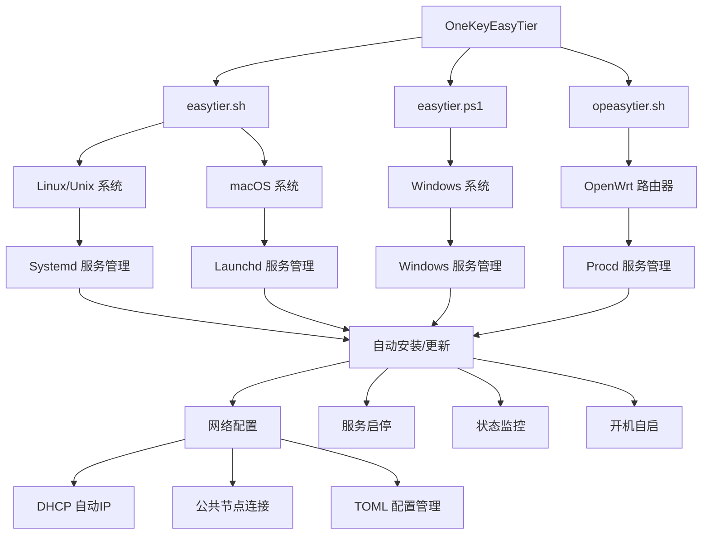

# OneKeyEasyTier 项目分析文档

## 项目概述

OneKeyEasyTier 是一个**全平台一键部署 EasyTier 网络的管理工具项目**，提供了三个核心脚本实现跨平台的 EasyTier 网络自动化部署和管理。

**一句话总结：** 一键组网工具，通过自动化脚本让用户在不同操作系统上快速部署和管理 EasyTier 虚拟网络。

## 项目关键参数

| 参数 | 值 | 说明 |
|------|-----|------|
| **项目类型** | 自动化部署脚本 | Shell + PowerShell 脚本项目 |
| **主要语言** | Bash/Shell, PowerShell | 跨平台脚本语言 |
| **目标平台** | Linux, macOS, Windows, OpenWrt | 全平台覆盖 |
| **支持的架构** | x86_64, aarch64 | 主流CPU架构支持 |
| **核心功能** | EasyTier 网络自动化部署 | 一键安装、配置、管理 |
| **代码量** | 1095行总计 | easytier.sh(368行) + opeasytier.sh(376行) + easytier.ps1(351行) |
| **GitHub 代理** | ghfast.top | 解决国内访问问题 |
| **版本管理** | 自动检测最新版本 | 基于 GitHub API |

## 项目结构 Tree 图

```
onekeyeasytier/
├── .git/                          # Git 版本控制
├── README.md                      # 项目说明文档
├── easytier.sh                    # Linux/macOS 通用部署脚本 (368行)
├── easytier.ps1                   # Windows PowerShell 部署脚本 (351行)
└── opeasytier.sh                  # OpenWrt 专用部署脚本 (376行)
```

## 项目架构 Mermaid 图



## 核心功能模块

### 1. easytier.sh (Linux/macOS 通用脚本)
- **平台支持**: Linux (Debian/Ubuntu, Alpine), macOS
- **服务管理**: Systemd (Linux), Launchd (macOS), OpenRC (Alpine)
- **特色功能**: 
  - 自动检测系统类型和服务管理器
  - 依赖自动安装 (curl, jq, unzip)
  - 创建 `/usr/local/bin/et` 快捷命令

### 2. easytier.ps1 (Windows 专用脚本)
- **平台支持**: Windows 系统
- **服务管理**: Windows 服务
- **特色功能**:
  - PowerShell 管理员权限检查
  - Windows 服务注册和管理
  - Program Files 和 ProgramData 标准路径

### 3. opeasytier.sh (OpenWrt 专用脚本)
- **平台支持**: OpenWrt 路由器系统
- **服务管理**: Procd (OpenWrt 服务管理器)
- **特色功能**:
  - aarch64 架构专用
  - 固定版本下载链接
  - OpenWrt 服务管理集成

## 通用功能特性

### 🖥️ 全平台支持
- **Linux**: Systemd (Debian/Ubuntu), OpenRC (Alpine)
- **macOS**: Launchd 服务管理
- **Windows**: Windows 服务
- **OpenWrt**: Procd 服务管理

### 🚀 智能化特性
- **自动依赖检测**: 自动安装 curl, jq, unzip 等必要工具
- **自动 IP 分配**: 支持 DHCP 自动获取虚拟 IP
- **默认公共节点**: 提供官方公共节点作为默认连接
- **自动快捷方式**: 创建 `et` 命令用于快速访问
- **自动启动**: 部署完成后自动启动服务并设置开机自启

### 🛡️ 稳定性保障
- **进程守护**: 不同平台使用对应的进程守护机制
- **GitHub 代理**: 内置代理解决国内访问问题
- **错误处理**: 完善的错误检查和用户提示
- **架构检测**: 自动检测系统架构并下载对应版本

## 技术实现亮点

1. **跨平台统一体验**: 三个脚本提供相似的交互界面和功能
2. **智能服务管理**: 根据不同系统选择最适合的服务管理方式
3. **自动化程度高**: 从安装到配置完全自动化，用户只需做选择
4. **网络优化**: 内置 GitHub 代理，解决国内网络访问问题
5. **架构适配**: 支持 x86_64 和 aarch64 主流架构

## 使用场景

- **个人用户**: 快速建立家庭或办公室的虚拟局域网
- **开发者**: 跨设备网络调试和测试
- **系统管理员**: 批量部署和管理网络节点
- **OpenWrt 用户**: 在路由器上部署网络中继节点

## 项目优势

1. **真正的一键部署**: 从零到完整网络环境只需几个命令
2. **全平台覆盖**: 几乎支持所有主流操作系统
3. **零配置门槛**: 自动化处理所有技术细节
4. **稳定可靠**: 完善的进程守护和错误恢复机制
5. **持续更新**: 自动检测和下载最新版本

---

*本文档基于项目代码结构分析生成，为新手和AI助手提供清晰的项目理解指南。*